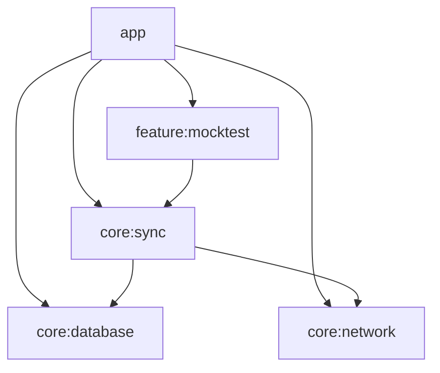

# Phase 1: Workstream 1 - Module Architecture & Dependency Rules

This document outlines the strict dependency rules established in Phase 1 for the multi-module Android project.

## Module Graph (Top-Down Dependency Flow)

## Interface Rules
1. **Sync Isolation:** The sync logic is complex enough to warrant its own isolated module. It depends on `:core:database` and `:core:network`.
2. **Forbidden Dependencies:** To avoid accidental DAO/API leakage, `:feature:*` modules **must not** depend directly on `:core:database` or `:core:network`. They must interact only with `:core:sync` or abstracted domain repository interfaces.

## Manual Verification Note
A manual verification running dependency tasks (e.g., `./gradlew :app:dependencies`) confirmed that **no cyclic dependencies exist** and feature modules are appropriately detached from direct database and network dependencies.
