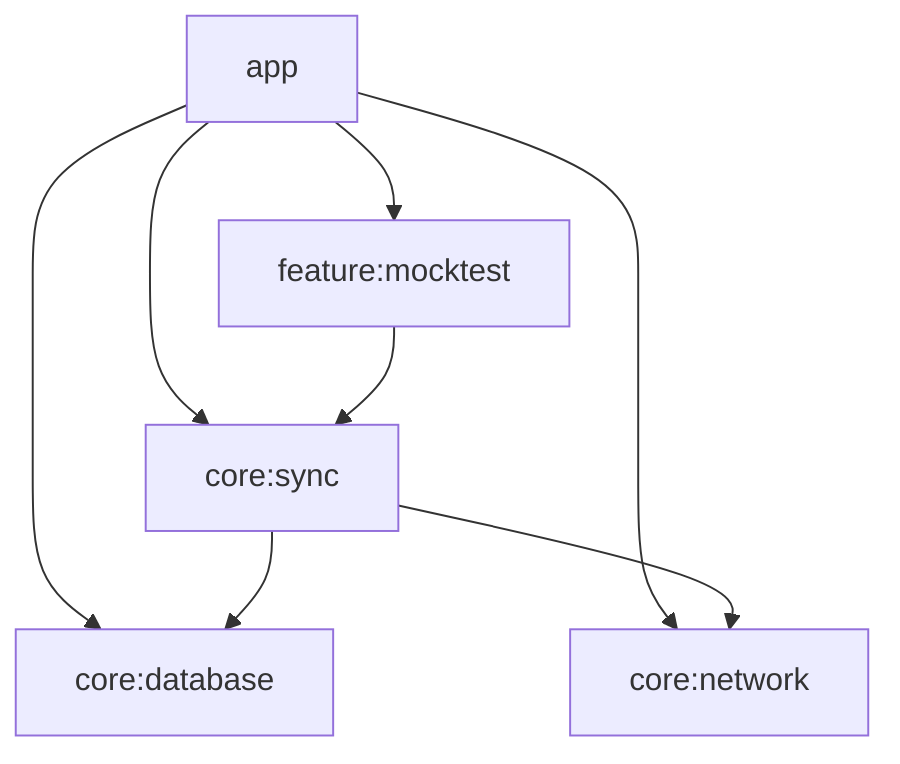

# Phase 1: Workstream 1 - Module Architecture & Dependency Rules

This document outlines the strict dependency rules established in Phase 1 for the multi-module Android project.

## Module Graph (Top-Down Dependency Flow)

## Interface Rules
1. **Sync Isolation:** The sync logic is complex enough to warrant its own isolated module. It depends on `:core:database` and `:core:network`.
2. **Forbidden Dependencies:** To avoid accidental DAO/API leakage, `:feature:*` modules **must not** depend directly on `:core:database` or `:core:network`. They must interact only with `:core:sync` or abstracted domain repository interfaces.

## Manual Verification Note
A manual verification running dependency tasks (e.g., `./gradlew :app:dependencies`) confirmed that **no cyclic dependencies exist** and feature modules are appropriately detached from direct database and network dependencies.

## Test DI Override Strategy

In our testing environments, we require deterministic execution without relying on actual external boundaries (like network APIs). To achieve this with Hilt:

1. **Network Fakes:** We provide a fake implementation of interfaces like `SyncNetworkDataSource` (e.g., `FakeSyncNetworkDataSource`) within the `test` directories.
2. **Hilt Test Module Replacement:** For instrumented and robolectric tests that use Hilt (`@HiltAndroidTest`), you can replace the real production DI modules using the `@UninstallModules` annotation on the test class, coupled with a corresponding `@InstallIn` test-specific module that provides the Fake.
3. **Manual Injection for Unit Tests:** For standard local unit tests (like `OutboxSyncWorkerTest`), we explicitly instantiate the system under test with the fake dependencies (e.g., `FakeSyncNetworkDataSource`) rather than spinning up the entire Hilt graph, ensuring faster test execution times and direct control over the fake's state.
